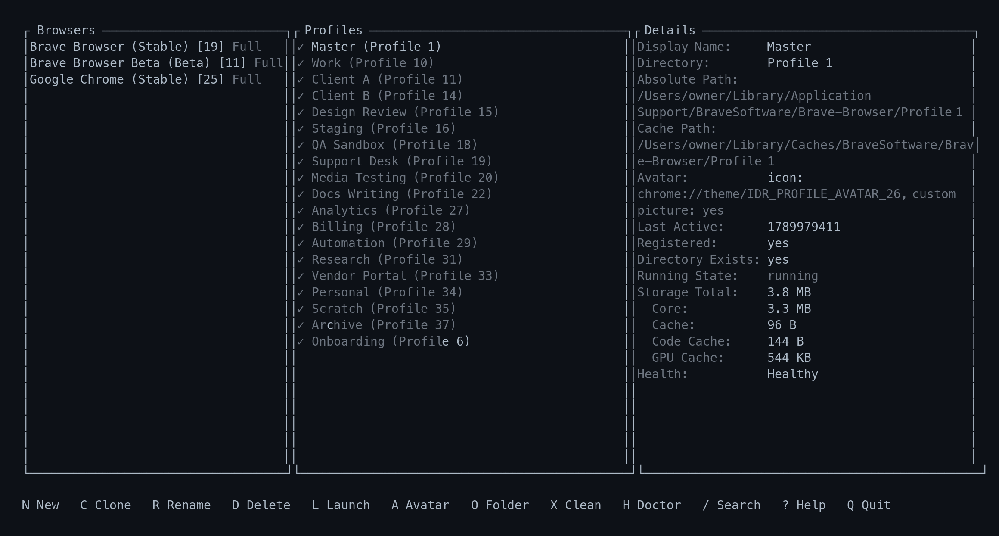
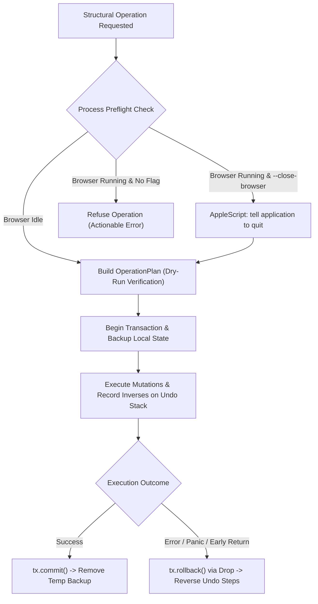
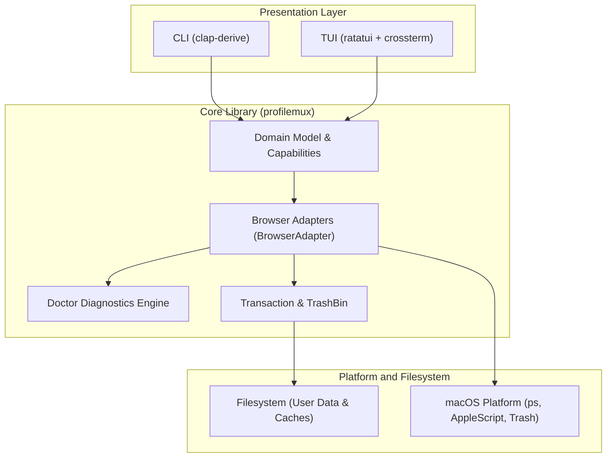

<h1 align="center">ProfileMux</h1>

<p align="center">
  A local-first browser profile manager for macOS.
</p>

<p align="center">
  Discover, inspect, create, clone, rename, launch and safely manage browser profiles from one TUI and CLI.
</p>

<p align="center">
  <a href="https://github.com/NN224/ProfileMux"></a>
  
  
  
  
  
  <a href="LICENSE"></a>
  
</p>

> [!IMPORTANT]
> **Structural Safeguards and Privacy Invariants**
>
> ProfileMux protects browser profile state through three layers of operational safeguards:
> - **Dry-Run Planning**: `create`, `clone`, `rename`, `delete` and `cache clean` accept `--dry-run`, which prints a deterministic execution plan naming every target path, planned mutation and reclaimed byte count, and changes nothing.
> - **Browser-Running Preflight**: Checks running status per user data root. Active roots refuse structural mutations unless `--close-browser` (CLI) or Quit Browser (TUI) requests a graceful quit via AppleScript (`tell application id "<bundle_id>" to quit`). ProfileMux never force-terminates browsers.
> - **Rollback Transactions**: Mutations execute inside an atomic filesystem transaction with an inverse-action undo stack and an isolated backup directory under the system temporary directory. Uncommitted transactions automatically roll back on error, panic, or early return via `Drop`.
>
> **Privacy Boundary**:
> - ProfileMux operates strictly at the structural container level.
> - Reports profile names, paths, sizes, and metadata only.
> - Never reads, displays, or parses password stores (`Login Data`), session cookies (`Cookies`), browsing histories (`History`), authentication tokens, or web storage.
> - Reports whether sensitive files exist and their size, never their internal contents.
> - Local-first: zero network calls, zero telemetry, zero analytics.

<p align="center">
  
</p>

<p align="center">
  <sub><i>A capture of the running TUI. Profile display names and the home directory are placeholders; the layout, sizes and status output are the application's own.</i></sub>
</p>

## Table of Contents

- [Overview](#overview)
- [Design Principles](#design-principles)
- [Features](#features)
- [Browser Support Matrix](#browser-support-matrix)
- [Safety Model and Invariants](#safety-model-and-invariants)
- [Installation and Building](#installation-and-building)
- [Getting Started](#getting-started)
- [Terminal User Interface](#terminal-user-interface)
- [Command-Line Interface](#command-line-interface)
- [Command Reference](#command-reference)
- [Profile Selectors](#profile-selectors)
- [Clone and Template Policies](#clone-and-template-policies)
- [Cache Management](#cache-management)
- [Doctor and Health Diagnostics](#doctor-and-health-diagnostics)
- [System Architecture](#system-architecture)
- [Development and Testing](#development-and-testing)
- [Known Limitations](#known-limitations)
- [Privacy Model](#privacy-model)
- [License](#license)

## Overview

ProfileMux (`pmux`) is a local-first Chromium browser profile manager for macOS, written in Rust. It consolidates profile discovery, metadata inspection, storage footprint analysis, health diagnostics, profile launching, and transaction-safe mutations across Chromium-family installations into a unified Ratatui terminal dashboard and scriptable CLI.

Both interfaces share a single core library (`profilemux`), guaranteeing identical validation rules, sanitization policies, and safety invariants regardless of whether an operation is initiated interactively or in automation.

| Capability | Category | Status | Operational Details |
| --- | --- | --- | --- |
| Application Discovery | Discovery | Stable | Locates macOS application bundles, bundle identifiers, release channels, and profile roots |
| Profile Inspection | Inspection | Stable | Extracts display names, directory names, avatars, timestamps, and registration flags from `Local State` |
| Storage Analysis | Inspection | Stable | Measures core directory, HTTP cache, code cache, and GPU cache footprint |
| Health Doctor | Diagnostics | Stable | Pure snapshot analysis for missing directories, orphan caches, duplicate IDs, and corrupt metadata |
| Profile Launching | Lifecycle | Stable | Spawns the browser executable targeting the profile via `--user-data-dir` and `--profile-directory` |
| Profile Creation | Mutation | Stable | Allocates directory, writes profile metadata, and registers the profile in `Local State` |
| Template Cloning | Mutation | Stable | Copies configuration settings while strictly excluding session credentials, histories, and cookies |
| Display-Name Renaming | Mutation | Stable | Updates the human-readable profile label in `Local State` without touching the on-disk directory |
| Custom Profile Avatar | Customization | Experimental | Normalizes images to 256x256 PNG format and installs avatar configuration (Brave only) |
| Safe Profile Deletion | Mutation | Stable | Moves profile folders and external caches to macOS Trash (`~/.Trash`); never invokes recursive removal |
| Cache Cleanup | Maintenance | Stable | Prunes temporary cache directories while preserving credentials, history, bookmarks, and sessions |

## Design Principles

| Principle | What it means |
| --- | --- |
| **Local-first** | Profile data never leaves the machine. No network calls, no telemetry, no account. |
| **Safety before mutation** | Every structural write is planned, preflighted, executed in a transaction and validated. |
| **Explicit support** | An operation an adapter cannot prove is safe is disabled and explained, never faked. |
| **Privacy-aware** | ProfileMux reads structure and size, never the contents of a browser's private stores. |
| **Scriptable** | The TUI and the CLI are two shells over one core library with identical rules. |
| **Real browser metadata** | ProfileMux reads the browser's own `Local State` and profile directories, not a side database. |

---

## Features

### Profile Management

- Discover installed browsers by macOS bundle identifier, with channel, version and profile count
- Inspect a profile's display name, directory, absolute path, cache path, avatar and registration state
- Launch a profile in its own browser
- Create a profile the browser actually recognises
- Clone an existing profile under a new identity
- Rename a display name without touching the directory
- Delete a profile to the macOS Trash
- Reveal a profile directory in Finder

### Templates

- Use any existing profile as a template, including one you keep as `Master`
- Carry over UI preferences, appearance, toolbar and sidebar layout and general browser settings
- Choose an explicit extension policy, defaulting to copying no extensions
- Exclude cookies, credentials, history, sessions and account identity by default

### Maintenance

- Per-profile storage breakdown across core, cache, code cache and GPU cache
- Cache-only cleanup over a fixed list of verified locations
- Reclaimable-space estimate shown before anything is removed
- `pmux doctor` structural health checks with stable finding codes

### Safety

- `--dry-run` on create, clone, rename, delete and cache clean, printing the plan and changing nothing
- One `OperationPlan` model rendered identically by the CLI and the TUI confirmation dialog
- Browser-running preflight scoped to the target user data root
- Rollback-capable transaction layer that also unwinds on an early return
- Ambiguous profile selectors refused with the candidate list rather than guessed

### Customization

- Custom profile avatar on Brave builds that claim the capability
- Deterministic, filesystem-safe directory naming derived from the display name
- Fuzzy filtering and search across profiles in the TUI

---

## Browser Support Matrix

ProfileMux interfaces directly with Chromium-family user data directories on macOS. Support levels reflect live validation against isolated `--user-data-dir` environments driven by real application binaries.

### Live-Validated Environments

The following installations have been live-validated on macOS across the complete nine-step operational lifecycle:

| Browser / Channel | Release Channel | Bundle Identifier | Profile Management | Custom Avatar | Directory Rename |
| --- | --- | --- | --- | --- | --- |
| Brave Browser | Stable (153.1.95.104) | `com.brave.Browser` | Full | Validated | Experimental |
| Brave Browser Beta | Beta (154.1.97.44) | `com.brave.Browser.beta` | Full | Validated | Experimental |
| Google Chrome | Stable (153.0.8010.52) | `com.google.Chrome` | Full | Not claimed | Experimental |

> Google Chrome (Stable) supports full profile management except custom avatars. The Chrome adapter deliberately does not claim the custom avatar capability, and it was therefore never validated.

### Nine-Step Validation Sequence

Every live-validated browser completed this sequence against an isolated temporary root:
1. Browser initialization: Spawning the application binary to initialize an isolated user data root.
2. Profile creation: Creating and registering a new profile on disk and in `Local State`.
3. Template creation: Cloning an existing profile with private-data exclusions verified.
4. Binary launch: Spawning the browser into the profile and confirming registration remains intact afterwards.
5. Cache cleanup: Pruning cache directories, verifying user data survival, and matching reclaimed bytes to estimates.
6. Display-name rename: Modifying the display label while verifying the underlying directory remains unchanged.
7. Doctor diagnostics: Executing diagnostic checks and verifying zero broken findings.
8. Trash deletion: Moving the profile directory and external caches to `~/.Trash` with metadata deregistration.
9. Process guard: Confirming that structural mutations are strictly refused while a browser instance holds the root open.

### Implemented, Not Locally Validated

Static discovery definitions and data path mappings exist in `src/browsers/chromium/discovery.rs` for the following browsers. They share the same adapter implementation as the validated browsers, but application binaries were not installed on the validation machine:

| Browser | Channels | Bundle Identifier | Implementation Status | Notes |
| --- | --- | --- | --- | --- |
| Chromium | Stable | `org.chromium.Chromium` | Implemented, not locally validated | Shared Chromium adapter |
| Microsoft Edge | Stable, Beta, Dev, Canary | `com.microsoft.edgemac.*` | Implemented, not locally validated | Shared Chromium adapter |
| Google Chrome | Beta, Dev, Canary | `com.google.Chrome.*` | Implemented, not locally validated | Shared Chromium adapter |
| Brave Browser | Nightly | `com.brave.Browser.nightly` | Implemented, not locally validated | Shared Chromium adapter |
| Vivaldi | Stable | `com.vivaldi.Vivaldi` | Implemented, not locally validated | Shared Chromium adapter |

These installations are implemented, not locally validated. They are not marked as verified or supported.

Non-Chromium browsers: There is no adapter for Firefox or Safari; neither is implemented.

## Safety Model and Invariants

ProfileMux treats browser profiles as critical data stores containing irreplaceable user configuration.



### Transactional Engine and Rollback

Every structural write to disk executes inside a `Transaction` (`src/fs/transaction.rs`):
- **Undo Log**: Pushes inverse actions to an in-memory stack before writing (`UndoStep::RemovePath`, `UndoStep::RestoreFile`, `UndoStep::RenameBack`).
- **Temporary Backup Storage**: Backs up modified files to `/tmp/pmux-<label>-<pid>-<nanos>-<count>`.
- **Atomic Commit**: Calling `tx.commit()` marks the transaction complete and purges the backup directory.
- **Drop Safety Net**: If execution halts prematurely—due to an error returned via `?`, an unhandled condition, or a panic—the `Drop` implementation automatically executes the rollback in reverse order.

### Browser-Running Preflight and Process State Guard

Modifying profile files while a browser holds SQLite write-ahead logs open risks database corruption:
- **Root-Scoped Detection**: Decided per user data root rather than per executable binary. Running an instance with a separate `--user-data-dir` does not block mutations on an idle root. Active processes are checked via `/bin/ps -Ao args=`.
- **Stale Lock Recovery**: If a dangling `SingletonLock` symlink exists after an ungraceful browser exit, ProfileMux verifies whether the target PID is alive via `/bin/ps -p <pid> -o pid=`. Dead PIDs are treated as stale locks and do not block execution.
- **Actionable Refusal**: The CLI refuses structural writes on active roots unless `--close-browser` is passed. The TUI prompts with Quit Browser or Cancel.
- **Graceful AppleScript Quits**: Browser terminations are requested exclusively through AppleScript (`tell application id "<bundle_id>" to quit`). ProfileMux never force-terminates a browser process.

### Safe Deletion via macOS Trash

ProfileMux never invokes recursive directory removal (`std::fs::remove_dir_all` or `rm -rf`) on user profile data:
- Profile folders and external cache folders are moved to `~/.Trash` via the `TrashBin` trait (`src/fs/trash.rs`).
- If an item with the same name already exists in Trash, collision counters are incremented (`Profile 1 2`, `Profile 1 3`).
- If the target profile resides on a separate volume, ProfileMux executes a safe copy-and-remove fallback across the filesystem boundary (`EXDEV`).
- Deleted profiles can be recovered directly from the macOS Trash.

### Directory Name Sanitization

Custom and generated directory names are sanitized deterministically (`src/domain/sanitize.rs`):
- Non-alphanumeric characters (excluding `_` and `.`) are converted to hyphens (e.g. `NIGHTCLUB & LOUNGE` becomes `NIGHTCLUB-LOUNGE`).
- Names are capped at 48 characters.
- Names cannot contain slashes (`/` or `\`), null bytes, leading dots, or directory traversal sequences (`..`).
- Reserved Chromium names are rejected: `.`, `..`, `System Profile`, `Guest Profile`, `Crashpad`, `Local State`, `component_crx_cache`, `extensions_crx_cache`.
- Containment checks enforce `path.parent() == Some(user_data_root)`. Any path escaping the root is rejected.
- Name collisions append incremental numeric suffixes (`-2`, `-3`).
- Display names remain untouched and preserve full Unicode, spaces, and emojis.

### Metadata Integrity (`Local State`)

Chromium maintains profile registration in `<user data root>/Local State`:
- `Local State` is copied into the transaction backup area prior to modification.
- Parsed via `serde_json::Value`. ProfileMux modifies only `profile.info_cache.<dir>` and `profile.profiles_order`. Unknown vendor keys and experimental feature flags are preserved untouched.
- Profile creation, cloning, renaming, and deletion update both registration structures simultaneously within the transaction.

## Installation and Building

Building ProfileMux requires Rust 1.80 or later on macOS.

### Install from Source

Install `pmux` to `~/.cargo/bin`:

```bash
cargo install --path .
pmux
```

Or build a release binary manually:

```bash
cargo build --release
cp target/release/pmux /usr/local/bin/
```

There is no Homebrew formula and no pre-built release binary.

### Uninstall

ProfileMux writes no background services, launch agents, shell hooks, config files, or internal databases. To uninstall, delete the binary:

```bash
cargo uninstall profilemux
# or remove the binary directly:
rm -f ~/.cargo/bin/pmux /usr/local/bin/pmux
```

## Getting Started

Open the TUI and launch a profile:

```bash
pmux
```

1. Pick a browser in the **Browsers** pane.
2. Press <kbd>Tab</kbd> to move to **Profiles** and select one.
3. Press <kbd>L</kbd> or <kbd>Enter</kbd> to launch it.

Create a profile from a template:

1. Press <kbd>N</kbd>.
2. Type the **Name**. The **Directory** field follows it, sanitized, until you edit it yourself.
3. Pick a **Template** profile, or `None`.
4. Pick an **Extensions** policy. The default copies none.
5. Optionally give an **Avatar** image path.
6. Confirm the plan. The dialog shows exactly what will be created and what is excluded.

---

## Terminal User Interface

Running `pmux` without subcommands opens the interactive three-pane dashboard:
- **Browsers (Left)**: Discovered installations, release channels, support status, and registered profile counts.
- **Profiles (Center)**: Profiles for the active browser with display names, directories, and health status indicators.
- **Details (Right)**: Metadata, process state, storage breakdown, and diagnostic findings.

```text
N New   C Clone   R Rename   D Delete   L Launch   A Avatar   O Folder   X Clean   H Doctor   / Search   ? Help   Q Quit
```

### Dashboard Keybindings

| Key | Action |
| --- | --- |
| `Up` / `k` | Move selection up in active pane |
| `Down` / `j` | Move selection down in active pane |
| `Tab` | Cycle focus forward (Browsers -> Profiles -> Details) |
| `Shift+Tab` / `BackTab` | Cycle focus backward |
| `h` / `Left` | Focus left pane |
| `l` / `Right` | Focus right pane |
| `Enter` / `L` | Launch selected profile |
| `i` | Open profile details overlay |
| `b` | Open browser details overlay |
| `F5` | Rescan storage sizes for selected profile |
| `N` | Open New Profile dialog |
| `C` | Open Clone Profile dialog |
| `R` | Open Rename Profile dialog |
| `D` | Open Delete Profile confirmation dialog |
| `A` | Open Set Avatar dialog |
| `O` | Reveal profile folder in Finder |
| `X` | Open Clean Cache confirmation dialog |
| `H` | Open Doctor health findings overlay |
| `/` | Filter profiles by fuzzy subsequence matching |
| `Esc` | Clear active filter / close modal dialog or overlay |
| `?` | Toggle keybinding help overlay |
| `q` / `Ctrl-C` | Quit ProfileMux |

### Modal Dialog Navigation

| Key | Action |
| --- | --- |
| `Up` / `Down` | Scroll plan output by one line |
| `PageUp` / `PageDown` | Scroll plan output by one page |
| `Left` / `Right` / `Tab` | Toggle between dialog buttons (e.g. Cancel / Confirm) |
| `Enter` | Execute the focused button action |
| `Esc` | Cancel operation and close dialog |

## Command-Line Interface

The `pmux` CLI provides scriptable inspection and mutation commands.

### Top-Level Commands

- `pmux browsers [--json]`
- `pmux profiles [--browser <slug>] [--sizes] [--json]`
- `pmux profile <subcommand>`
- `pmux cache <subcommand>`
- `pmux doctor [--browser <slug>] [--json]`

Flags `-h/--help` and `-V/--version` are available globally.

### Discover Discovered Browsers

```bash
pmux browsers
```

Sample output:

```text
NAME                CHANNEL  SLUG        VERSION        BUNDLE ID               USER DATA ROOT                                                             PROFILES  SUPPORT
Brave Browser       Stable   brave       153.1.95.104   com.brave.Browser       /Users/owner/Library/Application Support/BraveSoftware/Brave-Browser       6         Full
Brave Browser Beta  Beta     brave-beta  154.1.97.44    com.brave.Browser.beta  /Users/owner/Library/Application Support/BraveSoftware/Brave-Browser-Beta  3         Full
Google Chrome       Stable   chrome      153.0.8010.52  com.google.Chrome       /Users/owner/Library/Application Support/Google/Chrome                     4         Full
```

### List Profiles and Storage Footprint

```bash
pmux profiles --browser brave --sizes
```

Sample output:

```text
BROWSER     DISPLAY NAME  DIRECTORY   STATUS  SIZE
brave       Master        Default     ✓       19.3 MB
brave       Work          Profile 1   ✓       3.9 MB
brave       Client A      Profile 10  ✓       3.7 MB
```

### Show Profile Details

```bash
pmux profile show brave/Default
```

Sample output:

```text
Display Name:      Personal
Directory:         Default
Browser:           Brave Browser (Stable)
Absolute Path:     /Users/owner/Library/Application Support/BraveSoftware/Brave-Browser/Default
Cache Path:        /Users/owner/Library/Caches/BraveSoftware/Brave-Browser/Default
Avatar:            icon: chrome://theme/IDR_PROFILE_AVATAR_26, custom picture: no
Last Active:       1726857131
Registered:        yes
Directory Exists:  yes
Running:           no
Sizes:
  Total:           1.42 GB
  Core:            1.18 GB
  Cache:           184.2 MB
  Code Cache:      42.1 MB
  GPU Cache:       15.3 MB
```

### Reveal and Launch Profiles

Reveal profile directory in Finder:

```bash
pmux profile open brave/Default
```

Launch profile in its browser executable:

```bash
pmux profile launch brave/Default
```

### Create a Profile

Create an empty profile:

```bash
pmux profile create --browser brave --name "Staging"
```

Create a profile using an existing profile as a configuration template:

```bash
pmux profile create --browser brave --name "Testing" --template "Personal" --extensions none
```

Flags for `pmux profile create`:
- `--browser <slug>`: Target browser identifier (`brave`, `chrome`, etc.)
- `--name <NAME>`: Profile display name
- `--directory <DIR>`: Custom directory name (sanitized automatically if omitted)
- `--template <NAME-or-DIR>`: Source profile to copy preferences from
- `--avatar <PATH>`: Path to image file for custom avatar (Brave only)
- `--extensions <none|copy|copy-settings>`: Extension copy policy (default: `none`)
- `--open`: Launch browser with the new profile immediately after creation
- `--dry-run`: Simulate operation without modifying disk
- `--close-browser`: Gracefully quit browser instances via AppleScript before mutating

### Clone a Profile

```bash
pmux profile clone brave/Default --name "Personal Copy"
```

Flags match `profile create`, replacing `--browser` and `--template` with the positional `<selector>` argument.

### Rename a Profile

Rename display name only (instantaneous; browser may remain open):

```bash
pmux profile rename brave/Default --name "Primary Personal"
```

Rename profile directory on disk (experimental; requires browser closed):

```bash
pmux profile rename brave/Profile-1 --directory "Work" --close-browser
```

### Assign Custom Avatar (Brave only)

```bash
pmux profile avatar brave/Default ~/Pictures/avatar.png
```

Normalizes images to 256x256 PNG format, installs `Google Profile Picture.png` inside the profile directory, and updates `Local State` avatar configuration.

### Delete a Profile

Safely moves the profile folder and external cache directory to `~/.Trash` and deregisters the profile from `Local State`:

```bash
pmux profile delete brave/Profile-2
```

Simulate with dry-run:

```bash
pmux profile delete brave/Profile-2 --dry-run
```

Skip confirmation in non-interactive scripts:

```bash
pmux profile delete brave/Profile-2 --yes --close-browser
```

## Command Reference

| Command | Purpose |
| --- | --- |
| `pmux` | Open the three-pane TUI |
| `pmux browsers` | List discovered browser installations |
| `pmux profiles` | List profiles across browsers |
| `pmux doctor` | Run structural health checks |
| `pmux profile show <selector>` | Inspect one profile in full |
| `pmux profile open <selector>` | Reveal the profile directory in Finder |
| `pmux profile launch <selector>` | Launch the profile in its browser |
| `pmux profile create` | Create a profile, optionally from a template |
| `pmux profile clone <selector>` | Clone an existing profile |
| `pmux profile rename <selector>` | Rename the display name, or the directory with `--directory` |
| `pmux profile avatar <selector> <image>` | Set a custom profile avatar |
| `pmux profile delete <selector>` | Move a profile and its cache to the Trash |
| `pmux cache clean <selector>` | Remove only verified cache locations |

Read-only commands accept `--json`. `create`, `clone`, `rename`, `delete` and
`cache clean` accept `--dry-run` and `--close-browser`; `delete` and
`cache clean` additionally accept `--yes`. `profile avatar` takes no flags — it
still refuses to run while the target browser is open, but has no
`--close-browser` shortcut.

---

## Profile Selectors

Commands accepting a `<selector>` argument resolve targets using three formats in priority order:
1. Full `ProfileId`: `<browser-slug>:<user-data-root>/<directory>` (e.g. `brave:/Users/owner/Library/Application Support/BraveSoftware/Brave-Browser/Default`)
2. Slug and directory: `<browser-slug>/<directory>` (e.g. `brave/Default`, `chrome/Profile 1`)
3. Display name: `Personal`, `Work`

If a display name is ambiguous across installed browsers or profiles, ProfileMux refuses the operation and outputs matching candidate selectors instead of guessing.

## Clone and Template Policies

When creating a profile from a template or cloning an existing profile, ProfileMux executes a selective copy policy rather than duplicating the directory tree wholesale:

```bash
pmux profile clone brave/Default --name "Research Sandbox" --dry-run
```

Sample dry-run plan:

```text
CLONE PROFILE

Browser:   Brave Browser (Stable)
Profile:   Research Sandbox

Steps:
  Create profile directory — /Users/owner/Library/Application Support/BraveSoftware/Brave-Browser/Research-Sandbox
  Copy settings from template — Default
  Register profile in Local State — info_cache.Research-Sandbox

Copy:
  Preferences

Exclude:
  Bookmarks
  Extensions
  Cookies
  Login Data
  History
  Sessions
  Web Data
  Network state
  Account identity (GAIA)
  Local Storage
  Service Worker
  Top Sites

Requires the browser to be fully closed.
No files changed.
```

### Private Data Exclusions

The following private session and identity stores are excluded from clones:
- `Cookies` (session and authentication cookies)
- `Login Data`, `Login Data For Account` (stored credentials)
- `History`, `History-journal` (browsing records)
- `Sessions` (open tabs and windows)
- `Web Data` (autofill, web database records)
- `Network state` (network persistent state)
- Account identity (`account_info`, GAIA tokens)
- `Local Storage`, `IndexedDB`, `Service Worker`
- `Top Sites`
- `Bookmarks` (excluded by default)

### Preference Sanitization

When copying `Preferences`, sensitive keys are stripped before writing the target file:
- `account_info`, `gaia_cookie`, `signin`, `sync`, `google.services`
- `password_manager`, `profile.password_manager_enabled`, `credentials_enable_service`
- `autofill`, `profile.content_settings.exceptions`, `sessions`
- `safebrowsing`, `extensions.settings`, `extensions.install_signature`
- `ntp.custom_background_dict`, `media_router`, `dns_prefetching`

### Extension Policy

Extension copying is controlled by `--extensions <none|copy|copy-settings>`:
- `none` (default): No extensions are copied.
- `copy`: Copies installed extension payloads from `Extensions`.
- `copy-settings`: Copies `Extensions`, `Local Extension Settings`, and `Sync Extension Settings`.

> Extension copying is experimental. Chromium signs extension registrations in `Secure Preferences` with a per-profile Message Authentication Code (MAC). ProfileMux deliberately does not forge these signatures. Copied extensions may be dropped by the browser on next launch.

## Cache Management

ProfileMux provides targeted cache cleanup without risking personal data:

```bash
pmux cache clean brave/Default --dry-run
pmux cache clean brave/Default --yes
```

### Cleaned Locations

- Core profile directory: `Cache` (HTTP cache), `Code Cache` (compiled JS/Wasm), `GPUCache`, `ShaderCache`, `GrShaderCache`, `DawnCache`, `DawnGraphiteCache`, `DawnWebGPUCache`, `component_crx_cache`, and `Service Worker/CacheStorage`
- External cache directory: `~/Library/Caches/<browser-vendor>/<channel>/<profile-dir>`

### Preserved Locations

Cache cleanup never removes:
- `Cookies`, `Login Data`, `History`, `Bookmarks`
- `Preferences`, `Secure Preferences`, `Extensions`
- `Local Storage`, `Sessions`, `IndexedDB`, `Web Data`
- Custom avatar image (`Google Profile Picture.png`)

## Doctor and Health Diagnostics

The health doctor analyzes profile stores using pure snapshot analysis (`src/doctor/mod.rs`). It inspects the filesystem and `Local State` in a single read-only pass, emitting diagnostic findings without modifying files:

```bash
pmux doctor
```

Sample output:

```text
Brave Browser (Stable)
  ✓ Healthy
Brave Browser Beta (Beta)
  ✓ Healthy
Google Chrome (Stable)
  ⚠ [duplicate-display-name] Duplicate profile display name 'Work'
      /Users/owner/Library/Application Support/Google/Chrome/Profile 19
      /Users/owner/Library/Application Support/Google/Chrome/Profile 60
1 warning
```

### Diagnostic Finding Codes

| Code | Severity | Glyph | Diagnostic Condition |
| --- | --- | --- | --- |
| `local-state-malformed` | Broken | ✗ | `Local State` contains invalid JSON or cannot be parsed |
| `profile-directory-missing` | Broken | ✗ | Profile is registered in `Local State` but its on-disk directory does not exist |
| `duplicate-profile-path` | Broken | ✗ | On-disk path is claimed by multiple registered profiles |
| `profile-unregistered` | Warning | ⚠ | On-disk profile directory exists without a `Local State` registration |
| `cache-orphan` | Warning | ⚠ | Cache directory exists for an unregistered profile |
| `duplicate-display-name` | Warning | ⚠ | Multiple profiles share identical display names |
| `no-profiles` | Warning | ⚠ | Profile store contains no registered profiles |
| `stale-migration-artifact` | Warning | ⚠ | Directory uses a temporary `.pmux-tmp` or `.pmux-` migration prefix/suffix |

Doctor is read-only and never performs automatic repairs.

## System Architecture

ProfileMux enforces strict unidirectional layering. Presentation components (CLI and TUI) delegate entirely to the core library.



### Storage Measurement Breakdown

Profile storage measurements (`StorageBreakdown`) calculate recursive byte usage across five fields:
- `core`: Size of profile folder excluding cache subdirectories.
- `cache`: Size of HTTP cache directories (`Cache`).
- `code_cache`: Size of compiled JavaScript and WebAssembly caches (`Code Cache`).
- `gpu_cache`: Size of the GPU cache (`GPUCache`).
- `total`: Aggregate footprint across core directory and cache stores.

### Dependencies

Direct dependencies from `Cargo.toml`:
- `anyhow 1`: Application-level error handling.
- `clap 4` (derive): Command-line argument parsing and help generation.
- `crossterm 0.28`: Terminal raw mode, event loop, and alternate screen handling.
- `dirs 5`: Standard user directory resolution (`~/Library`, `~/.Trash`).
- `image 0.25` (png, jpeg features): Avatar image decoding and resizing.
- `plist 1`: macOS application bundle `Info.plist` parsing.
- `ratatui 0.29`: Terminal user interface rendering.
- `serde 1`, `serde_json 1`: JSON serialization for `Local State` and CLI output.
- `thiserror 2`: Domain error definitions.
- `tempfile 3` (dev-dependency): Isolated directory fixtures for integration tests.

## Privacy Model

ProfileMux operates exclusively at the container management level:
- Does not inspect or export credentials stored in `Login Data`.
- Does not inspect or dump session tokens in `Cookies`.
- Does not read browsing history or search queries in `History`.
- Does not parse HTML5 local storage or IndexedDB tables.
- Reports paths, sizes, and operational flags only.
- Completely local-first: zero network requests, zero telemetry, zero analytics.

## Development and Testing

```bash
git clone https://github.com/NN224/ProfileMux.git
cd ProfileMux
cargo test
cargo run
```

Quality gates, all of which pass on the current tree:

```bash
cargo fmt --check
cargo clippy --all-targets --all-features -- -D warnings
cargo test
```

The suite is **116 passing tests** plus 5 that are `#[ignore]`d because they drive
real browsers. Those live tests point each real browser binary at an isolated
temporary user data root through Chromium's own `--user-data-dir` override:

```bash
cargo test --test live_browser -- --ignored --nocapture
```

Every mutation test runs against a `tempfile` fixture or an isolated root, and
sends deletions to a fake trash bin. No test ever targets a real browser profile
or the real Trash, and the running-browser preflight is never bypassed.

---

## Known Limitations

| Limitation | Detail |
| --- | --- |
| No Firefox adapter | Firefox uses `profiles.ini` and a different profile model. Not implemented. |
| No Safari adapter | Not implemented. |
| macOS only | Discovery, launch, graceful quit and Trash are macOS-specific, though the core is portable. |
| Custom avatar not claimed on Chrome | Verified on Brave only; the Chrome adapter does not claim the capability, so it is never attempted. |
| Directory rename is experimental | Covered by fixture tests including rollback, but never live-validated against a real browser. |
| Extension copying is experimental | Chromium MACs extension registrations per profile; ProfileMux does not forge those signatures, so copied extensions may be dropped on next start. |
| Other Chromium builds unvalidated | Chromium, Edge, Vivaldi, Brave Nightly and the non-stable Chrome channels are implemented but not installed here, so they are untested. |
| No permanent delete | Deletion always goes to the Trash. Emptying it is left to the user. |

---

## License

ProfileMux is licensed under the [MIT License](LICENSE).
